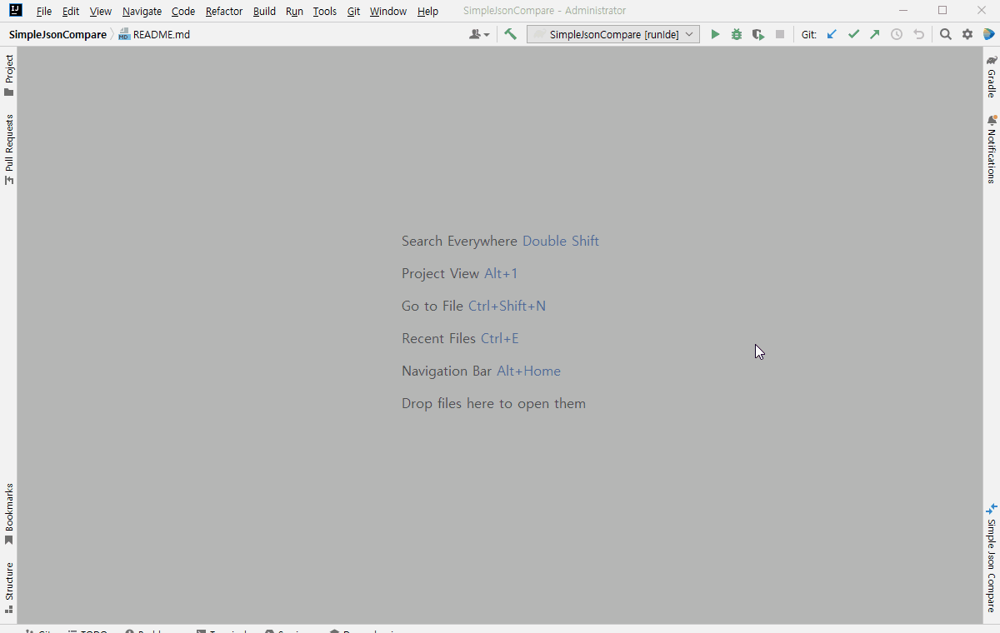
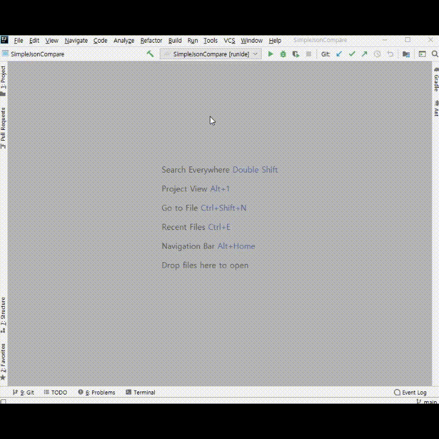

# Simple Json Compare

Left URL과 Right URL의 Json 데이터를 서로 비교해서 다른 부분을 표시해 주는 IntelliJ Plugin 입니다.

### Java 11 or higher.

---

### IntelliJ version 2020.2.1 or later.

---

### 사용 방법

---

    1. 오른쪽 Tool Window의 'Simple Json Compare' 클릭 또는 IntelliJ Menu > Tools > Simple Json Compare 선택

    2. Method 선택

    3. Left URL 입력 (http://ip:port/path?parameter)

    4. Right URL 입력 (http://ip:port 또는 http://ip:port/path?parameter)

    5. 필요한 경우 Body 입력

    6. Compare 버튼 클릭

    * 아래 GIF 참조

---

자매품 : https://github.com/koreaward-6/MyJsonCompare

---

---
